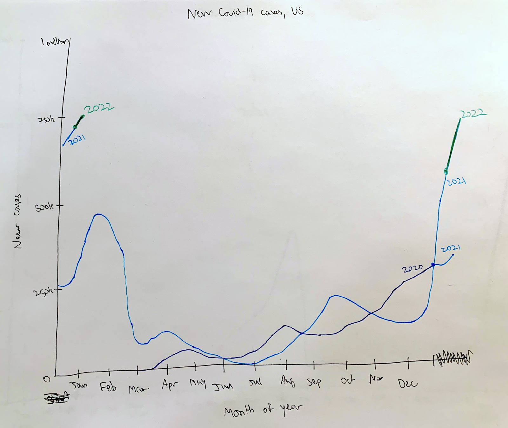

<link rel="stylesheet" type="text/css" href="https://schare.space/css/default.css">
<link rel="stylesheet" type="text/css" href="https://schare.space/css/article.css">
<link rel="stylesheet" type="text/css" href="https://schare.space/css/wide.css">

# Assignment 3 | 6.C85 Vis & Society
[Carmel Schare (schare@mit.edu)]{.subtitle}
[28 Feb 2026 (3 late days used)]{.date}

## Reading and Critique
![ []{} ](img/covid-spiral.png)

Insights about the data:

- Hard to identify consistent patterns from less than 2 years of data. Winter is
  of course a spike in cases (this is standard for disease transmission, with
  everyone cooped up inside) but US Covid cases only started appearing after the
  peak of winter in 2020, so there's only a year of data.
- Early summer is indeed "less favorable for viral transmission" but early fall
  2021 was much worse than 2020. This might have to do with people returning to
  schools after summer break. Maybe 2021 was worse than 2020 because there were
  less precautions taken to mitigate transmission.
- If 2022 is similar to 2021, we should expect cases to decline starting in
  mid-January. And like 2021 and 2020, they might plateau from the end of
  February until a further decline in summer, starting in May and reaching a
  minimum in June.

Design critique:

## Sketches

Rationale for Sketch 1:

-
- 
- 

Rationale for Sketch 2:

-
- 
- 

Rationale for Sketch 3:

-
- 
- 

## Final design

## Final writeup
