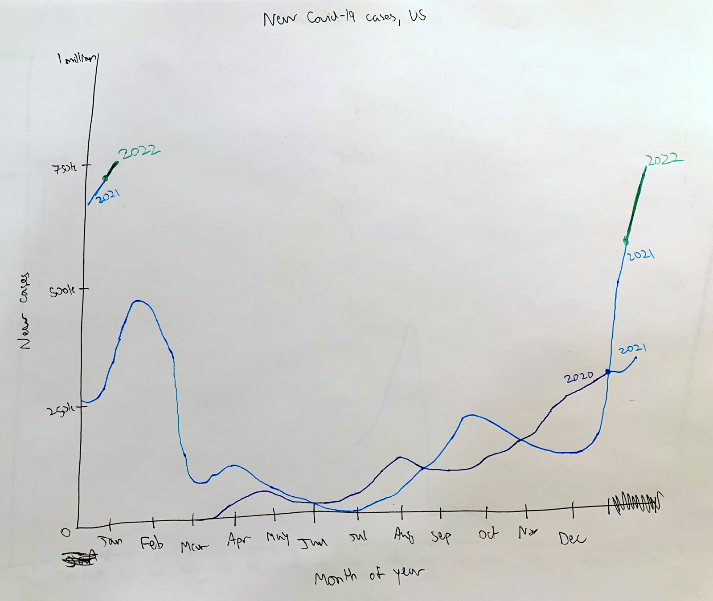
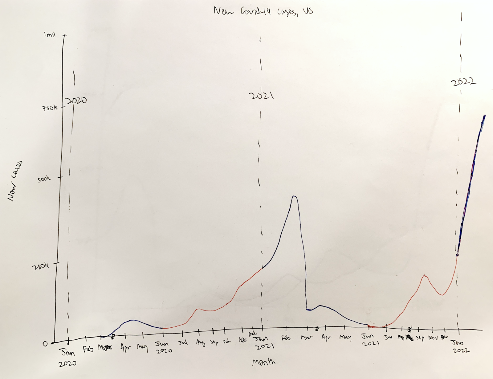
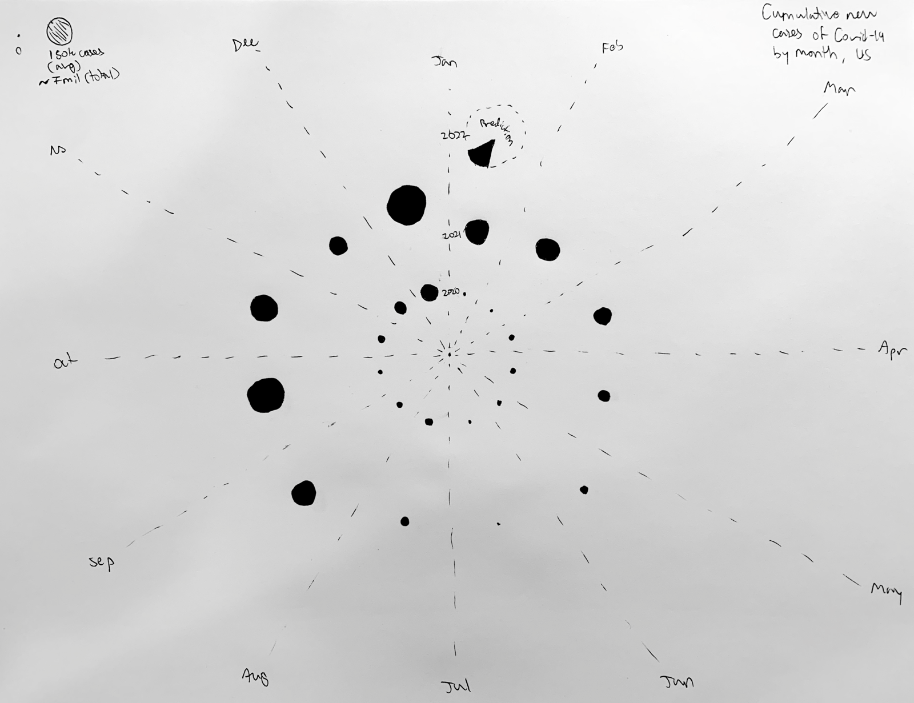
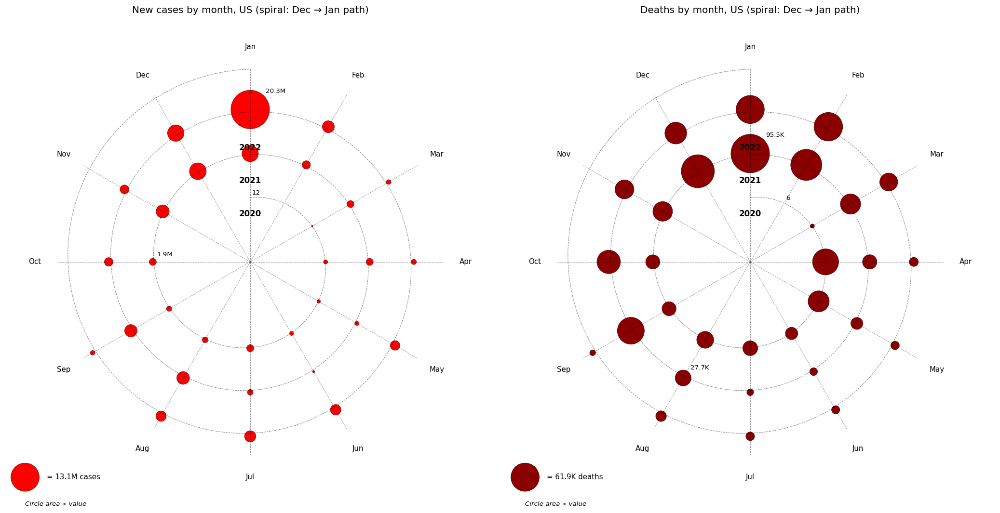
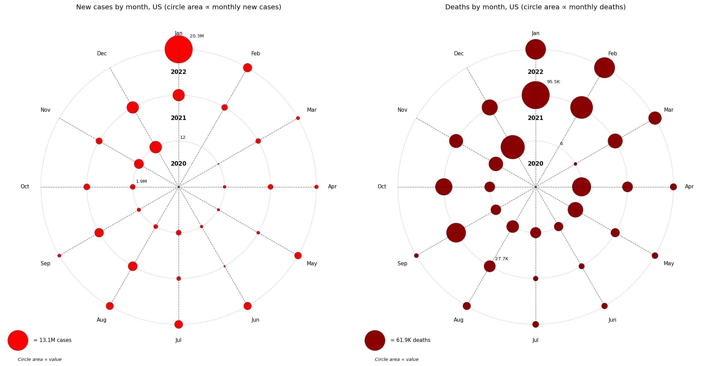

<link rel="stylesheet" type="text/css"
href="https://schare.space/css/default.css"> <link rel="stylesheet"
type="text/css" href="https://schare.space/css/article.css"> <link
rel="stylesheet" type="text/css" href="https://schare.space/css/wide.css">

# Assignment 3 | 6.C85 Vis & Society
[Carmel Schare (schare@mit.edu)]{.subtitle}
[28 Feb 2026 (3 late days used)]{.date}

## Reading and Critique
![ []{} ](img/covid-spiral.png)

Insights about the data:

- Hard to identify consistent patterns from less than 2 years of data. Winter is
  of course a spike in cases (this is standard for disease transmission, with
  everyone cooped up inside) but US Covid cases only started appearing after the
  peak of winter in 2020, so there's only a year of data.
- Early summer is indeed "less favorable for viral transmission" but early fall
  2021 was much worse than 2020. This might have to do with people returning to
  schools after summer break. Maybe 2021 was worse than 2020 because there were
  less precautions taken to mitigate transmission. 
- If 2022 is similar to 2021, we should expect cases to decline starting in
  mid-January. And like 2021 and 2020, they might plateau from the end of February
  until a further decline in summer, starting in May and reaching a minimum in
  June.

Design critique:

The spiral with width for magnitude is definitely effective and expressive.
Thickness of the line expressively encodes the number of new cases because
length is something we perceive very intuitively, as mentioned in the lecture on
magnitude estimation. The spiral for time is slightly more questionable but it
is not terribly unusual, so it is an expressive choice for representing time as
the months map cleanly and uniquely onto the positions along the circumference,
and it has the advantage of making it easy to compare the same season across
years, which is very effective given the nature of the data (disease
transmission follows seasonal patterns). Only a few encoding channels (width of
line and position along the spiral, and date labels) are used so the
visualization is not too cluttered (e.g. there is only one color on the mark);
it is not overwhelming, and it is clear how to start reading it.  The labels are
clear and not deceptive, but I would prefer magnitude labels annotating the
spiral at its extreme points, to give some numerical context. The visualization
is not very compact because the spacing of the rings of the spiral is adjusted
to the maximum magnitude across all years, the maximum being in January 2022.
Plus, the spiral feels off-center, leaning left, but it is unclear to me how to
avoid this given that there is no more 2022 data to balance it visually.

The data about new cases by weekly average is clear, not hidden. But other data,
and important aspects about the data collection process, are not shown here. For
instance we are only seeing reported cases, we see nothing about the fatality
rate, the total number of tests, or more subtle things like how long people are
infected for. Still, as long as the audience understands that this is new cases
by weekly average and not cumulative cases, they should be able to correctly
read the visualization. That said it is unconventional to use a spiral.

Since the main point of the visualization is the rapid increase of new reported
cases in late 2021 and January 2022, which is featured prominently at the center
top, the takeaway message is clear and crisp. However, the content of the
article is mostly about the _uncertainty_ involved in predicting the future
course of the pandemic. We could consider epistemically humble and aligned with
the message of the article that this visualization lacks any marks for
prediction, with or without error bars or multiple outcomes, but we could also
say it fails to provide any useful information for readers. The visualizations
later in the article do show possible future trajectories, so it is probably a
display of responsibility on the part of the designer not to include
tentative/unreliable predictions in the headline visualization and instead stick
with observed factual data.

## Sketches

Rationale for Sketch 1:

- Wanted to try a simple, straightforward line chart since the radial chart was
  slightly more perceptually confusing.
- Stacked the years so we can visually compare. Used different colors for each
  year to visually distinguish them. (It's hard to see in the image, but 2020 is
  dark blue, 2021 is light blue, and 2022 is green.)
- Stuck with new cases (instead of cumulative cases) because it is a sensible
  metric and because I am just sketching alternatives, not yet using the dataset.
- Found that the line chart made it difficult to see how the years connect
  because there is a cutoff at the end of December before we start over, so in my
  next sketch I want to try a different way of emphasizing the seasonal peaks and
  troughs.

Rationale for Sketch 2:

- Still a line chart but instead of different lines for each year, I put the
  entire trend over time. 
- Since we cannot easily compare years by season this way, I use different
  colors to visually emphasize the seasons. (It's hard to see in the image, but
  blue is winter and red is summer.) I think this was useful, but it is definitely
  actually better to use a radial chart since the calendar is a cyclical
  structure; it is easier to compare things by aligning them along a spatial
  dimension rather than coloring them similarly, even though the color did work
  quite well in my opinion. 
- I want next to try binning by month, as seeing the magnitude on the y-axis
  here isn't as visually striking or intuitive as the radius used in the original
  visualization.

Rationale for Sketch 3:

- Tried using circle area to show magnitude, binned by total new cases by month,
  and returning to a radial chart to show the dates.
- I eyeballed the cumulative new cases; I'd like to try using the actual data.
- Years are stacked outward like tree rings.
- This still shows some continuity but loses some granular detail due to the
  binning. I want to recover the granular detail.

## Final design

## Final writeup
I liked my third sketch because it effectively and expressively communicated the
main story of the data (patterns of cases by month) while improving on the
layout issues of the original, so for the final visualization (created using
matplotlib, numpy, and pandas in Python with the aid of Cursor Pro+) I chose to
retain the binned tree ring design with actual data. Since the color channel was
free, I experimented with showing deaths in order to get a more complete sense
of how dangerous each wave is. But the number of deaths is so consistently tiny
compared to the number of new cases that it is barely visible in the
visualization and I removed it. I figured any way of displaying it in the same
visualization as the new cases (such as having two different scales) would be
deceptive and confusing. Instead I provide it as a small multiples display,
faceting new cases and deaths across the same amount of time. I worry that this
is still deceptive because they are different scales, but I try to make this
clear with a large legend and magnitude annotations. Hopefully these compensate
for the change of scale.

I could also have visualized the number of total tests as an alternative way to
provide extra (but different) context, but there seem to be quality problems
with that data so I chose to investigate deaths instead. By doing this I am able
to provide a more engaging and deep visualization that gives insight into more
aspects of the pandemic.

I made sure to apply Stevens' power law to the circle areas, using p=0.7, to
compensate for perceptual bias in estimating area.

By binning the data we do lose the trends within each month but we get the basic
gist more clearly at a glance. I chose to bring back the spiral because without
it is very unintuitive to follow the trend from December to January.  At first I
made it without the spiral but I went back after seeing what a poor choice that
was. For completeness I show that version below.  My spiral design doesn't feel
as off-center as the original design because, though I proportioned the position
of each year ring along the center circle radius the same way as the original
(adjusted to maximum magnitude of data), my magnitude is in area, not width, and
because it is perceptually balanced thanks to the extra few months of data in
the dataset. I think this is a good improvement on the original visualization
aesthetically speaking.

During the process I found it hard to imagine beyond the choices of the original
visualization. Certainly part of this is because the designer made a lot of good
choices that, after I experimented with the sketches, I chose to retain. But
also I think my imagination was occluded. I am reminded of a parable I learned
from my labmate: on a project investigating child creativity where kids were
invited to draw fish on an electronic canvas that would then animate their
drawings swimming around an aquarium, his intuition said the children would be
most creative if they started with a blank canvas---no pre-existing forms to
dull their imagination. Indeed, they drew a greater diversity of fish starting
from nothing than when there were a few fish already there to inspire them. But
when there were very many fish, and a great variety already present, the
children were **much more** creative, and a huge diversity of forms emerged from
their imaginations. The lesson is that seeing just a few examples constrains our
creativity but many examples gets us to notice patterns and see how to combine
them or break them to form interesting new results. If I was to do this project
over again I would start by looking for a bunch of examples of other ways to
visualize Covid-19 data. Then maybe I wouldn't have such a hard time seeing
beyond the choices made by the original designer.

## Appendix: non-spiral version
